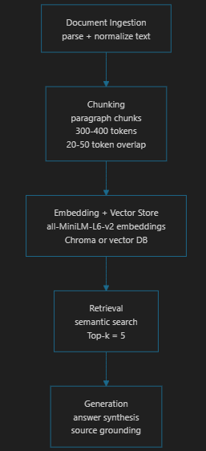

# Project 1 Planning: The Unofficial Guide

> Write this document before you write any pipeline code.
> Your spec and architecture diagram are what you'll use to direct AI tools (Claude, Copilot, etc.) to generate your implementation — the more specific they are, the more useful the generated code will be.
> Update the Retrieval Approach and Chunking Strategy sections if you change your approach during implementation.
> Update this file before starting any stretch features.

---

## Domain

<!-- What domain did you choose? Why is this knowledge valuable and hard to find through official channels? -->
San Francisco restaurant recommendations. This konwledge valuable because it contains the wait time/difficulty of appointment, quality, and recommended food for each restaurant. The official channels only shows menus, location, and business hours. They rarely contains cumstomer experience and food quility.
---

## Documents

<!-- List your specific sources: URLs, subreddit names, forum threads, or file descriptions.
     Aim for at least 10 sources that together cover different subtopics or perspectives within your domain. -->

| # | Source | Description | URL or location |
|---|--------|-------------|-----------------|
| 1 |Eater SF Article|The 38 Best Restaurants in San Francisco|https://sf.eater.com/maps/best-restaurants-san-francisco-38|
| 2 |Reddit Thread|Restaurant Recommendation and Omission List in SF|https://www.reddit.com/r/AskSF/comments/1j178op/san_francisco_restaurant_list_recommendations_and/|
| 3 |Reddit Thread|Currently the best restaurants in San Francisco|https://www.reddit.com/r/AskSF/comments/1rad0pt/what_is_currently_the_best_restaurants_in_san/|
| 4 |Article|Top 100 Restaurants in the Bay Area in 2025|https://www.sfchronicle.com/projects/2025/top-100-best-restaurants-san-francisco-bay-area/|
| 5 |Quora Question|Recommend restaurant for someone visiting San Francisco|https://www.quora.com/What-restaurant-would-you-recommend-to-someone-visiting-San-Francisco|
| 6 |Quora|Must try San Francisco restaurants|https://www.quora.com/What-are-some-must-try-San-Francisco-restaurants|
| 7 |Article|San Francisco’s Top 10 Restaurants To Visit|https://www.jsfashionista.com/san-franciscos-top-10-restaurants/|
| 8 |Yelp Restaurant Page|Most reviewed Restaurants "Zushi Puzzle" in SF|https://www.yelp.com/biz/zushi-puzzle-san-francisco-2?osq=Restaurants|
| 9 |Reddit Thread|The Most "San Francisco" Restaurants in SF|https://www.reddit.com/r/AskSF/comments/1le4ps5/the_most_san_francisco_restaurants_in_sf/|
| 10 |Michelin Guide of San Francisco Restaurants|Michelin rated and recommended restaurants in San Francisco|https://guide.michelin.com/us/en/california/san-francisco/restaurants|

---

## Chunking Strategy

<!-- How will you split documents into chunks?
     State your chunk size (in tokens or characters), overlap size, and explain why those
     numbers fit the structure of your documents.
     A review-heavy corpus warrants different chunking than a long FAQ. -->

**Chunk size:**
I'll use paragraph chunks, it will be 300-400 token for each chunk. 
**Overlap:**
20-50 tokens 
**Reasoning:**
Because my resources are mostly short reviews or short answers, even articles are one paragraphs for each restaurant. Paragraph chunks can keep the meaning better.
---

## Retrieval Approach

<!-- Which embedding model are you using (e.g., all-MiniLM-L6-v2 via sentence-transformers)?
     How many chunks will you retrieve per query (top-k)?
     If you were deploying this for real users and cost wasn't a constraint, what tradeoffs
     would you weigh in choosing a different embedding model — context length, multilingual
     support, accuracy on domain-specific text, latency? -->

**Embedding model:**
all-MiniLM-L6-v2 via sentence-transformers
**Top-k:**
5
**Production tradeoff reflection:**
As I am using free api key, I'll use bigger and heavier model for a accurate answer, but the tradeoff is that there might be some latency. As I mentioned before, I want to keep paragraph chunk to avoid lose information, so the model will have a longer context length. Most of the materials are common food terms, there is few food specific terms.
---

## Evaluation Plan

<!-- List your 5 test questions with their expected correct answers.
     Questions should be specific enough that you can judge whether the system's response
     is right or wrong. "What are good dining halls?" is too vague.
     "What do students say about wait times at [dining hall name] during lunch?" is testable. -->

| # | Question | Expected answer |
|---|----------|-----------------|
| 1 |What do people say about the food quality and atmosphere at Zushi Puzzle|Reviews generally describe it as a high-quality sushi spot with fresh fish, creative rolls, and a modern but casual atmosphere; often praised for taste but sometimes noted as pricey.|
| 2 |What does the Michelin guide say about the best restaurant in SF for a celebration meal?|The Michelin-rated restaurant name plus mention of celebration|
| 3 |Which source mentions parking or transit challenges, and what does it say?|The restaurant name plus a short statement about parking/transit issues.|
| 4 |What does the corpus recommend for someone who wants a good value group dinner|The restaurant name with supporting detail about affordability or group-friendly atmosphere.|
| 5 |Which San Francisco restaurant is recommended for a first-time visitor who wants classic local food|A specific restaurant plus a short reason|

---

## Anticipated Challenges

<!-- What could go wrong? Name at least two specific risks with reasoning.
     Consider: noisy or inconsistent documents, missing source attribution, off-topic
     retrieval, chunks that split key information across boundaries. -->

1. missing meaning of information. If chunks split a restaurant recommendation across boundaries, the model may miss the full context or key details.

2. Inconsistent source structure.The sources include articles, Reddit comments, and Michelin entries, so document format will vary.

---

## Architecture

<!-- Draw a diagram of your pipeline showing the five stages:
     Document Ingestion → Chunking → Embedding + Vector Store → Retrieval → Generation
     Label each stage with the tool or library you're using.
     You can use ASCII art, a Mermaid diagram, or embed a sketch as an image.
     You'll use this diagram as context when prompting AI tools to implement each stage. -->
     

---

## AI Tool Plan

<!-- For each part of the pipeline below, describe:
     - Which AI tool you plan to use (Claude, Copilot, ChatGPT, etc.)
     - What you'll give it as input (which sections of this planning.md, which requirements)
     - What you expect it to produce
     - How you'll verify the output matches your spec

     "I'll use AI to help me code" is not a plan.
     "I'll give Claude my Chunking Strategy section and ask it to implement chunk_text()
     with my specified chunk size and overlap" is a plan. -->

**Milestone 3 — Ingestion and chunking:**
I'll give Claude / Copilot my domain, documents, and chunking strategy to ask it implement the chunk method.
**Milestone 4 — Embedding and retrieval:**
I'll give Claude / Copilot my Retrieval Approach and requirements to let it emplement the embedding method

**Milestone 5 — Generation and interface:**
I'll ask Claude / Copilot to implement method that connect retrieval to LLM to generate grounded answers, and build a simple interface.